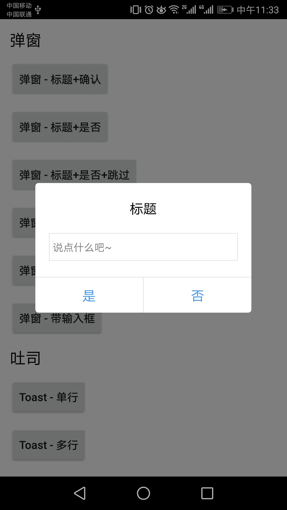
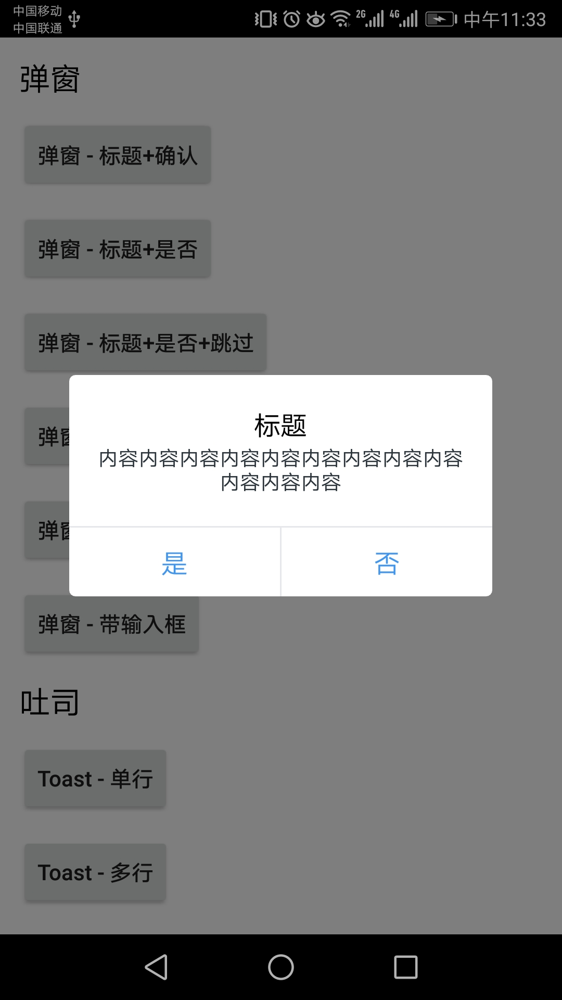
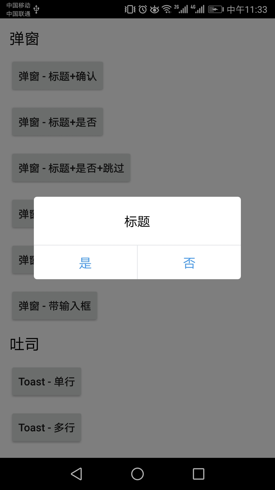
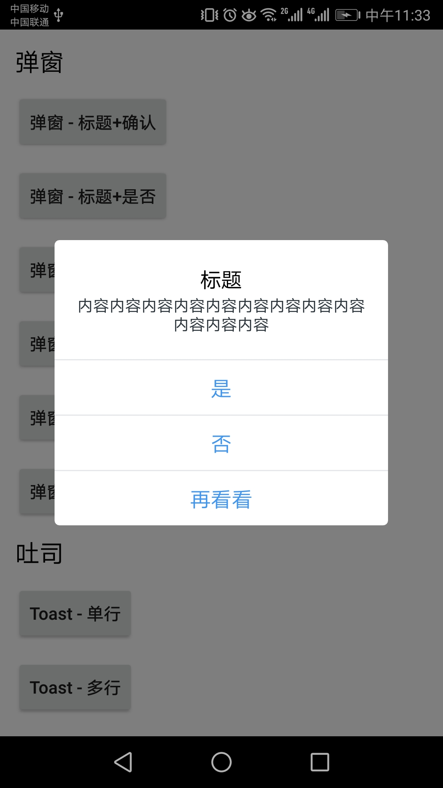
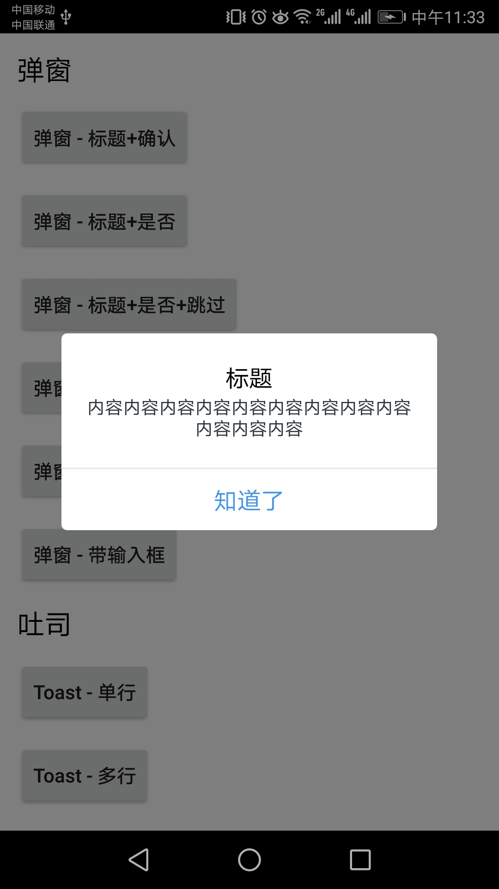
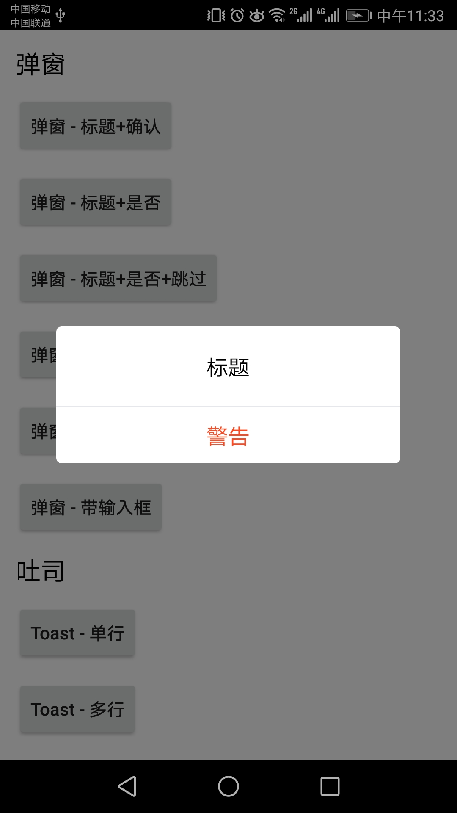

# Dialog 对话框

> dialog 组件说明文档

### 分类（两种使用方式一致）
 - EUIHorizontalDialog 操作按钮并排
 - EUIVerticalDialog 操作按钮竖排
 
### 效果图
 
 ##### EUIHorizontalDialog 第一个是默认效果
    
    
   
    
 ##### EUIVerticalDialog 第一个是默认效果
    
    
   
   
### 使用方式
<pre>
 EUIVerticalDialog.Builder builder = new EUIVerticalDialog.Builder(this);
 builder.setTitle("标题");
 builder.setContent("内容内容内容内容内容内容内容内容内容内容内容内容");
 builder.setPositiveButton("知道了", new View.OnClickListener() {
     @Override
     public void onClick(View view) {
         Toast.makeText(MainActivity.this, "点我试试", Toast.LENGTH_SHORT).show();
        }
    });
 builder.create().show();
    
 其中 builder.create()返回对应dialog，若要执行关闭操作返回dialog使用dialog.dismiss。</pre>
 
### API 
 
 ##### EUIHorizontalDialog
 
 | 属性 | 说明 | 类型 | 默认 |
 | ------------- |------------- | ----- |
 | title | 标题 | string | 标题 |
 | content | 内容 | string | 内容 |
 | needContent | 是否显示内容 | boolean | false |
 | needInput | 是否显示输入框 | boolean | false |
 | cancelable | 点击外部是否可以被关闭 | boolean | true |
 | positiveStr | 左侧操作按钮文字 | string | 是 |
 | negativeStr | 右侧操作按钮文字 | string | 否 |
 | positiveButtonClick | 点击左侧操作按钮 | object | null |
 | negativeButtonClick | 点击右侧操作按钮 | object | null |
 
 ##### EUIVerticalDialog
  
  | 属性 | 说明 | 类型 | 默认 |
  | ------------- |------------- | ----- |
  | title | 标题 | string | 标题 |
  | content | 内容 | string | 内容 |
  | positiveStr | 第一行操作按钮文字 | boolean | false |
  | negativeStr | 第二行操作按钮文字 | boolean | false |
  | cancelStr | 第三行操作按钮文字 | boolean | true |
  | warnStr | 第四行操作按钮文字 | string | 是 |
  | needContent | 是否显示内容 | string | 否 |
  | needPositive | 是否显示第一行操作按钮 | boolean | false |
  | needNegative | 是否显示第二行操作按钮 | boolean | false |
  | needCancel | 是否显示第三行操作按钮 | boolean | false |
  | needWarn | 是否显示第四行操作按钮 | boolean | false |
  | cancelable | 点击外部是否可以被关闭 | boolean | true |
  | positiveButtonClick | 点击第一行操作按钮 | object | null |
  | negativeButtonClick | 点击第二行操作按钮 | object | null |
  | cancelButtonClick | 点击第三行操作按钮 | object | null |
  | warnButtonClick | 点击第四行操作按钮 | object | null |
  

