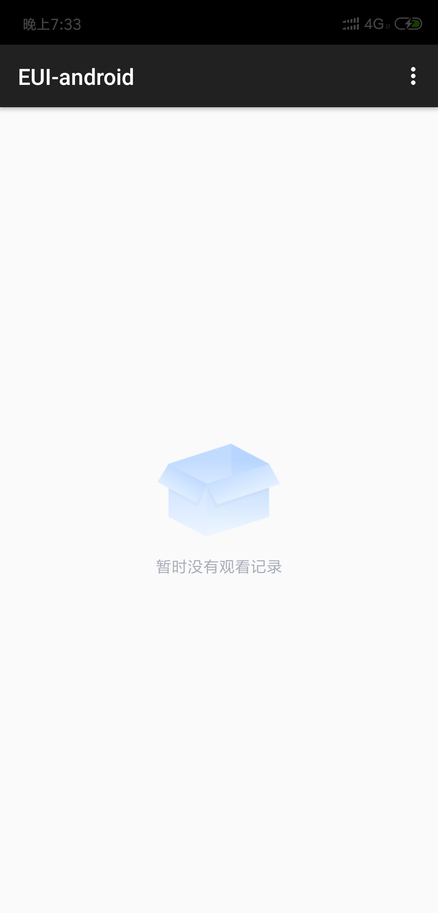
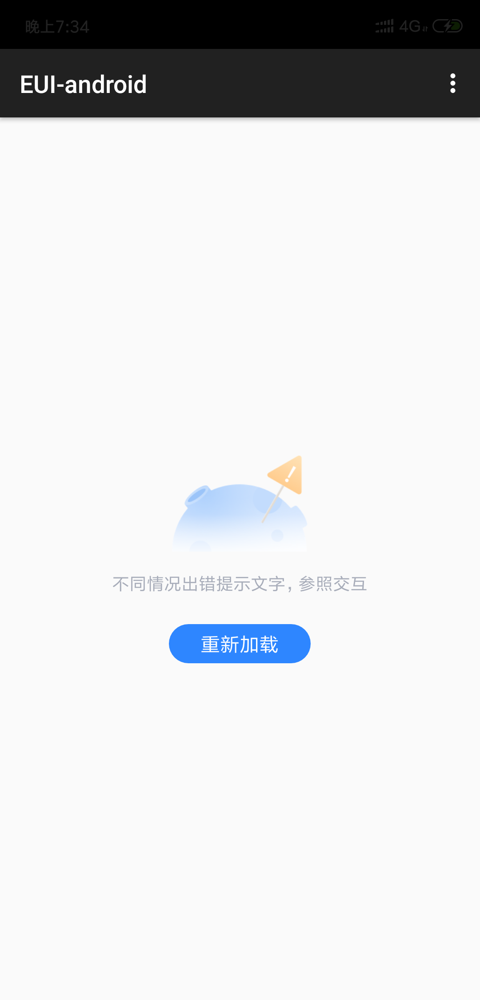

# EmptyLayout 空内容

> 空数据

### 效果图
 ##### 显示列表
 
 
 ##### 显示数据为空
 
 
 ##### 显示加载错误
 
 
### 使用方式
 
<pre>
  emptyLayout.bindView(内容布局/内容控件);
  emptyLayout.showSuccess();//显示内容
  emptyLayout.showEmpty();//显示数据为空
  emptyLayout.showError();//显示加载错误
</pre>
 
### API 

- bindView() 绑定内容布局，执行其他api之前一定要先调用这个api
- showSuccess() 数据加载成功，显示内容
- showEmpty() 数据为空
- showEmpty(String text) 数据为空，自定义提示内容
- showEmpty(String text,int emptyResource) 数据为空，自定义提示内容和icon
- showError() 加载出错
- showError(String text) 加载出错，自定义提示内容
- showError(String text,int emptyResource) 加载出错，自定义提示内容和icon
- setReloadListener(OnClickListener listener) 加载出错重新加载点击事件
- setReloadListener(String reloadStr,OnClickListener listener) 自定义重新加载按钮文字